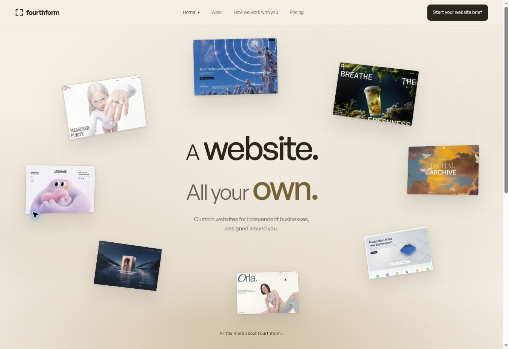

# Fourthform release verification

Production commit: `a9378e70827fe5f76b0c86809a414821d3b14e19`.

Both Vercel production deployments are READY. The public marketing homepage, real website brief and client portal preview were opened and inspected after publication.

- Marketing: https://fourthform-marketing.vercel.app/
- Real brief: https://fourthform-marketing.vercel.app/brief
- Portal preview: https://fourthform-client-portal.vercel.app/preview
- Successful validation: https://github.com/mlngaxri/fourthform/actions/runs/37128595180
- Successful production deployment: https://github.com/mlngaxri/fourthform/actions/runs/37128595263

All 13 marketing and preview browser suites passed. The connected portal checks passed against an isolated real Supabase instance, covering accounts, private storage, CMS and customer workflows. Type checks and the structural, backend and environment tests passed.

Desktop inspection at 1363 by 936 confirmed General Sans, no horizontal overflow and changing orbit transforms without clicking a start control. The saved screenshot is the unmodified public landing page. The live portal uses the same agency typography while the customer website retains its own typography.

The Home link and useful content below the first viewport are present. Pricing and portfolio references lead to the visitor's own blank brief. Unfinished drafts save locally, chosen scope survives reload, answers download as plain text and unsaved navigation can be cancelled. The portal preview's primary next step leads to the same real brief.

All 20 original images and four recordings are preserved. The explorable website studies are labelled reconstructions around the original artwork because runnable source was unavailable for most of the catalogue. Their navigation and sample enquiry interactions work; sample enquiries do not send or store details.

Online brief submission remains disabled until email delivery is configured. Local save and download are available. Successful isolated backend checks do not assert that live third-party accounts, email or payments are configured.

